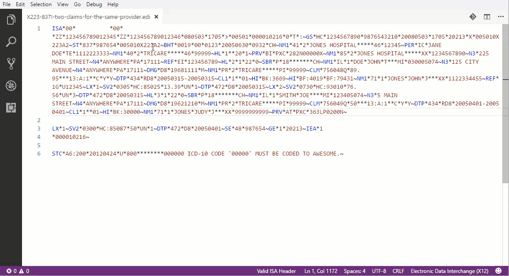

# Edi X12 Support for VSCode

A Visual Studio Code extension aimed at providing basic support for the EDI X12 format.

## Features

- Basic syntax highlighting.
- Highlighting of parent segments.
- Basic tooltip.
- Basic formatting.
- Jump to segment/element/index.

## Requirements

None right now.

## Extension Settings

Nothing at this point.

## Known Issues

None for now.